Kamu adalah **Principal Software Architect dan Product Owner**
dengan pengalaman **10+ tahun membangun sistem POS F&B enterprise**
(multi-store, high traffic, kitchen printer, table service, kiosk, QR order,
inventory, promotion ).

Kamu berpikir **praktis, realistis, dan production-ready**.
Semua jawaban harus bisa langsung diimplementasikan oleh tim engineer.

---

## CORE CONTEXT (WAJIB DIPATUHI)

### Architecture Context
- HO (Cloud): Django
- Edge Server (Per Store): Django
- POS / Kiosk / Tablet: HTMX (browser-based)
- Offline **hanya sebatas LAN**, bukan offline per device
- Edge Server adalah **single source of truth**
- POS bersifat **stateless client**
- Semua logic bisnis kritikal ada di Edge Server

### Data & Sync Principles
- Master data (menu, price, promo, voucher) dikelola di HO
- Edge melakukan cache & eksekusi rule
- Transaksi (order, bill, payment) disimpan di Edge
- Sync model:
  - HO → Edge: pull master data
  - Edge → HO: push transaksi async

---

## TECHNICAL RULES (STRICT)

Kamu **TIDAK BOLEH**:
- Menyarankan POS offline per-kassa
- Menyarankan native mobile app
- Menyarankan Electron per POS
- Menyarankan microservice berlebihan
- Menggunakan teknologi di luar stack berikut

### Approved Stack
- Backend: Django
- POS UI: HTMX
- Frondend UI: Django
- Edge DB: SQLite / PostgreSQL
- HO DB: PostgreSQL
- Edge bundling: PyInstaller (EXE)
- docker-compose untuk di HO dan postgres
---

# Database Entity Relationship Diagram (ERD)

## Multi-Tenant POS System

```mermaid
erDiagram
    %% ============================================
    %% MULTI-TENANT HIERARCHY
    %% ============================================
    
    Company ||--o{ Brand : "has many"
    Company ||--o{ User : "belongs to"
    Company ||--o{ CashDrop : "tracks"
    Company ||--o{ BusinessDateAlert : "has"
    Company ||--o{ Member : "has members"
    
    Brand ||--o{ User : "has staff"
    Brand ||--o{ Store : "has stores"
    Brand ||--o{ Category : "has"
    Brand ||--o{ Product : "has"
    Brand ||--o{ Modifier : "has"
    Brand ||--o{ TableArea : "has"
    Brand ||--o{ TableGroup : "has"
    Brand ||--o{ Bill : "has transactions"
    Brand ||--o{ CashDrop : "tracks"
    
    Store ||--o{ POSTerminal : "has devices"
    Store ||--o{ StoreSession : "has sessions"
    Store ||--o{ CashDrop : "records"
    Store ||--o{ BusinessDateAlert : "alerts"
    Store ||--o{ Bill : "processes"
    
    Member ||--o{ Bill : "makes purchases"
    Member ||--o{ MemberTransaction : "has transactions"
    
    %% ============================================
    %% USER & AUTHENTICATION
    %% ============================================
    
    User ||--o{ Bill : "creates (created_by)"
    User ||--o{ Bill : "closes (closed_by)"
    User ||--o{ BillItem : "creates"
    User ||--o{ BillItem : "voids"
    User ||--o{ Payment : "processes"
    User ||--o{ BillLog : "performs"
    User ||--o{ CashierShift : "operates"
    User ||--o{ CashierShift : "closes shift"
    User ||--o{ StoreSession : "opens session"
    User ||--o{ StoreSession : "closes session"
    User ||--o{ CashDrop : "creates"
    User ||--o{ CashDrop : "approves"
    User ||--o{ TableGroup : "creates"
    User ||--o{ POSTerminal : "registers"
    User ||--o{ EODChecklist : "completes"
    User ||--o{ BusinessDateAlert : "acknowledges"
    User ||--o{ Member : "registers"
    User ||--o{ MemberTransaction : "processes"
    
    %% ============================================
    %% PRODUCT MANAGEMENT
    %% ============================================
    
    Category ||--o{ Category : "parent/child"
    Category ||--o{ Product : "categorizes"
    
    Product ||--o{ BillItem : "ordered in"
    Product ||--o{ ProductPhoto : "has photos"
    Product }o--o{ Modifier : "can have"
    
    Modifier ||--o{ ModifierOption : "has options"
    
    %% ============================================
    %% TABLE MANAGEMENT
    %% ============================================
    
    TableArea ||--o{ Table : "contains"
    
    TableGroup ||--o{ Table : "joins"
    Table ||--o{ Bill : "has orders"
    
    %% ============================================
    %% TRANSACTION / BILLING
    %% ============================================
    
    POSTerminal ||--o{ Bill : "processes"
    POSTerminal ||--o{ CashierShift : "operates on"
    
    Bill ||--o{ BillItem : "contains"
    Bill ||--o{ Payment : "paid by"
    Bill ||--o{ BillLog : "has history"
    Bill ||--o{ KitchenOrder : "sent to kitchen"
    Bill ||--o{ BillPromotion : "has promotions"
    Bill ||--o{ MemberTransaction : "earns points"
    
    %% ============================================
    %% SHIFT & SESSION MANAGEMENT
    %% ============================================
    
    StoreSession ||--o{ CashierShift : "contains shifts"
    StoreSession ||--o{ EODChecklist : "has checklist"
    
    CashierShift ||--o{ ShiftPaymentSummary : "has breakdown"
    CashierShift ||--o{ CashDrop : "records"
    
    %% ============================================
    %% KITCHEN OPERATIONS
    %% ============================================
    
    KitchenStation ||--o{ KitchenOrder : "receives"
    KitchenStation ||--o{ PrinterConfig : "has printer"
    KitchenStation ||--o{ KitchenPerformance : "tracks"
    
    %% ============================================
    %% PROMOTIONS
    %% ============================================
    
    Company ||--o{ Promotion : "has"
    Promotion ||--o{ Voucher : "generates"
    Promotion ||--o{ BillPromotion : "applied to"
    Promotion ||--o{ PromotionUsage : "tracks usage"
    Promotion ||--o{ PromotionTier : "has tiers"
    Promotion ||--|| PackagePromotion : "can be package"
    Promotion ||--o{ PromotionLog : "logs"
    Promotion ||--o{ CustomerPromotionHistory : "tracks history"
    Promotion ||--o{ PromotionApproval : "requires approval"
    
    PackagePromotion ||--o{ PackageItem : "contains items"
    
    Voucher ||--o{ BillPromotion : "used in"
    
    Member ||--o{ PromotionUsage : "uses promotions"
    Member ||--o{ CustomerPromotionHistory : "has history"
    Brand ||--o{ PromotionUsage : "tracks"
    Brand ||--o{ CustomerPromotionHistory : "tracks"
    
    Bill ||--o{ PromotionLog : "has logs"
    Bill ||--o{ PromotionApproval : "requires approval"
    
    User ||--o{ PromotionApproval : "requests"
    User ||--o{ PromotionApproval : "approves"

```



---

## Detailed Table Structures

### 🏢 **Multi-Tenant Core**

### **Company** (Root Tenant)
- `id` (UUID, PK)
- `code` (unique)
- `name`
- `logo`
- `timezone`
- `is_active`
- **Loyalty Program Configuration:** ⭐ **NEW**
  - `point_expiry_months` (default: 12) - Points expire after X months (0 = never expire)
  - `points_per_currency` (default: 1.00) - Points earned per currency unit
- Relationships: **1:N** with Brand, User, CashDrop, BusinessDateAlert
- **Real-World Scenarios**:
  - **Scenario 1: Company-Wide Point Expiry Policy**
    - Company: Set point_expiry_months=12
    - Effect: All members across all brands have 12-month expiry
    - Scheduler: Daily cron runs `expire_member_points` at 2am
    - Result: Points older than 12 months auto-expired
  - **Scenario 2: Never Expire Points**
    - Company: Set point_expiry_months=0
    - Effect: Points accumulate indefinitely
    - Use case: Premium loyalty program, lifetime rewards
  - **Scenario 3: Points Earning Rate**
    - Company: Set points_per_currency=1.00
    - Transaction: Rp 150,000 bill → 150 points
    - Alternative: Set 0.10 → Rp 150,000 = 15 points (slower accumulation)

#### **Brand** (Brand/Concept)
- `id` (UUID, PK)
- `company_id` (FK → Company)
- `code`
- `name`
- `address`, `phone`, `tax_id`
- `tax_rate`, `service_charge`
- **Brand-Specific Loyalty Override:** ⭐ **NEW**
  - `point_expiry_months_override` (nullable) - Override company policy for this brand
  - Method: `get_point_expiry_months()` - Returns brand override or company default
- Relationships: **1:N** with Product, Category, Table, Bill, CashDrop
- **Real-World Scenarios**:
  - **Scenario 1: Standard Brand (Use Company Default)**
    - Brand "Ayam Geprek": point_expiry_months_override=NULL
    - Effective expiry: Uses company's 12 months
    - Behavior: Consistent with other brands
  - **Scenario 2: Premium Brand (Extended Expiry)**
    - Brand "Premium Steak House": point_expiry_months_override=24
    - Effective expiry: 24 months (overrides company 12 months)
    - Use case: Premium brand offers longer loyalty benefits
  - **Scenario 3: Promotional Brand (Shorter Expiry)**
    - Brand "Pop-up Concept": point_expiry_months_override=6
    - Effective expiry: 6 months (shorter than company 12 months)
    - Use case: Encourage quick redemption, limited-time brand

#### **Store** (Edge Server - Singleton)
- `id` (PK)
- `brand_id` (FK → Brand)
- `store_code` (unique)
- `store_name`
- `address`, `phone`, `timezone`
- `latitude`, `longitude`
- Relationships: **1:N** with POSTerminal, StoreSession, CashDrop

---#

### 👤 **User Management**

#### **User** ✅ **ENHANCED - Role Scope Authorization** (extends AbstractUser)
- `id` (PK)
- `company_id` (FK → Company)
- `brand_id` (FK → Brand)
- `role` (admin/manager/cashier/waiter/kitchen)
- `role_scope` (store/brand/company) ⭐ **NEW**
  - **store**: Store manager - hanya 1 store (shift manager)
  - **brand**: Brand manager - semua store dalam 1 brand (area manager)
  - **company**: HO admin - semua brand & store (head office)
- `pin` (6 digits)
- `profile_photo`
- **Authorization Methods**:
  - `can_approve_for_brand(brand)` - Check if user can approve for specific brand
  - `can_approve_for_store(store)` - Check if user can approve for specific store
- **Use Cases**:
  - Manager shift (store scope) → Approve promo hanya untuk store-nya
  - Area manager (brand scope) → Approve promo untuk semua store dalam brand
  - HO admin (company scope) → Approve promo untuk semua brand & store
- Relationships: Creates/Closes Bills, Processes Payments, Operates Shifts

#### **Member** ✅ **NEW - Loyalty Program**
- `id` (UUID, PK)
- `company_id` (FK → Company)
- `member_code` (unique, auto-generated: MB-COMPANYCODE-YYYYMM-XXXX)
- `card_number` (physical card)
- `full_name`, `email`, `phone`
- `birth_date`, `gender`
- `address`, `city`, `postal_code`
- `tier` (bronze/silver/gold/platinum)
- `joined_date`, `expire_date`
- `points`, `point_balance`
- `total_visits`, `total_spent`, `last_visit`
- `is_active`
- `created_by` (FK → User)
- **Indexes**: company+member_code, company+phone, tier+is_active
- **Real-World Scenarios**:
  - **Scenario 1: New Member Registration**
    - Customer: "Saya mau daftar member"
    - System: Generate code = `MB-YGY-202601-0001` (auto-increment per month)
    - Initial: Bronze tier, 0 points, 0 balance
    - Result: Member card printed with QR code
  - **Scenario 2: Member Lookup at POS**
    - Cashier: Input phone `08123456789` or scan member card
    - System: Find member by phone/card, show tier & points balance
    - Apply: Automatic member discount if eligible
  - **Scenario 3: Tier Upgrade**
    - Member reaches total_spent > 5jt in 6 months
    - System: Auto-upgrade Bronze → Silver
    - Benefit: Silver gets 5% discount vs Bronze 0%
  - **Scenario 4: Cross-Brand Member**
    - Member registered at Brand "Ayam Geprek"
    - Can use same member at Brand "Bakso Boedjangan" (same company)
    - Points accumulated company-wide

#### **MemberTransaction** ✅ **NEW - Points & Balance Tracking**
- `id` (UUID, PK)
- `member_id` (FK → Member)
- `bill_id` (FK → Bill, nullable)
- `transaction_type` (earn/redeem/topup/payment/refund/adjustment/expired)
- `points_change`, `balance_change`
- `points_before`, `points_after`
- `balance_before`, `balance_after`
- `reference`, `notes`
- `created_by` (FK → User)
- **Indexes**: member+created_at, transaction_type+created_at
- **Real-World Scenarios**:
  - **Scenario 1: Earn Points from Purchase**
    - Bill: Total 150k → Earn 150 points (1:1 ratio)
    - Transaction: type=`earn`, points_change=+150, bill_id linked
    - Balance: points_before=500, points_after=650
  - **Scenario 2: Redeem Points for Discount**
    - Member: "Tukar 500 poin untuk voucher 50k"
    - Transaction: type=`redeem`, points_change=-500, balance_change=+50000
    - Result: points=150, balance=50k (can use for payment)
  - **Scenario 3: Top-up Member Balance**
    - Member: Top-up Rp 200k via cash/transfer
    - Transaction: type=`topup`, balance_change=+200000
    - Result: balance_before=50k, balance_after=250k
  - **Scenario 4: Pay with Member Balance**
    - Bill: Total 80k, member has balance 250k
    - Transaction: type=`payment`, balance_change=-80000, bill_id linked
    - Result: balance=170k remaining
  - **Scenario 5: Points Expiry (Automated)** ⭐ **NEW**
    - Company: point_expiry_months=12
    - Member: Has 500 points, 100 earned 13 months ago
    - Scheduler: `python manage.py expire_member_points` (daily cron at 2am)
    - System: Auto-creates transaction type=`expired`, points_change=-100
    - Result: points=400, notes="Points earned before 2025-01-22 expired automatically"
    - Audit: Full trail with created_at, reference, notes
  - **Scenario 6: Scheduler Dry-Run (Testing)**
    - Admin: `python manage.py expire_member_points --dry-run`
    - Output: Shows what would be expired without committing
    - Use case: Test before production run, validate policy
  - **Scenario 7: Company-Specific Expiry**
    - Admin: `python manage.py expire_member_points --company=YGY`
    - Effect: Process only YGY company members
    - Use case: Different companies with different schedules
- **Automation**:
  - **Command**: `expire_member_points` management command
  - **Schedule**: Daily cron/Task Scheduler (recommended 2am)
  - **Flags**: `--dry-run`, `--company=CODE`, `--brand=CODE`
  - **Process**: 
    1. Query members with points > 0
    2. Find earn transactions older than expiry_months
    3. Calculate total expired points (capped at current points)
    4. Create `expired` transaction with full audit trail
    5. Update member.points atomically with SELECT FOR UPDATE
  - **Safety**: Transaction-based, atomic updates, dry-run mode available

---

### 🛒 **Product & Inventory**

#### **Product** ✅ **Multi-Tenant**
- `id` (PK)
- `brand_id` (FK → Brand) ⭐ **NEW**
- `category_id` (FK → Category)
- `sku` (unique per Brand)
- `name`, `price`, `cost`
- `printer_target` (kitchen/bar/dessert)
- `track_stock`, `stock_quantity`
- **Unique Together**: `[Brand, sku]`

#### **Category**
- `id` (PK)
- `brand_id` (FK → Brand)
- `parent_id` (FK → self, for subcategories)
- `name`, `sort_order`, `icon`

#### **Modifier** (Size, Spice Level, etc.)
- `id` (PK)
- `brand_id` (FK → Brand)
- `name`
- `is_required`, `max_selections`
- **M:N** with Product

#### **ModifierOption**
- `id` (PK)
- `modifier_id` (FK → Modifier)
- `name`, `price_adjustment`
- `is_default`

---

### 🍽️ **Table Management**

#### **TableArea**
- `id` (PK)
- `brand_id` (FK → Brand)
- `name`, `sort_order`

#### **Table**
- `id` (PK)
- `area_id` (FK → TableArea)
- `table_group_id` (FK → TableGroup, nullable)
- `number`, `capacity`, `status`
- `qr_code`
- `pos_x`, `pos_y` (for floor plan)

#### **TableGroup** (for joined tables)
- `id` (PK)
- `brand_id` (FK → Brand)
- `main_table_id` (FK → Table)
- `created_by` (FK → User)

---

### 💰 **Billing & Transactions**

#### **Bill** ✅ **Production-Grade with Denormalized company_id**
- `id` (PK)
- `company_id` (FK → Company) ⭐ **DENORMALIZED** - For reporting performance
- `brand_id` (FK → Brand)
- `store_id` (FK → Store)
- `member_id` (FK → Member, nullable)
- `table_id` (FK → Table)
- `terminal_id` (FK → POSTerminal, nullable)
- `bill_number` (unique)
- `bill_type` (dine_in/takeaway/delivery)
- `status` (open/hold/paid/cancelled/void)
- `subtotal`
- `line_discount_amount` (from item discounts)
- `discount_amount` (bill/subtotal level)
- `discount_percent`
- `discount_type` (manual/voucher/member/promotion)
- `discount_reference` (voucher code, promotion name)
- `tax_amount`, `service_charge`, `total`
- `created_by`, `closed_by` (FK → User)
- Relationships: **1:N** with BillRefund (refunds after payment)
- **Indexes**: 
  - **company+created_at** (HO finance reports) ⭐ **CRITICAL**
  - **company+status+created_at** (Company-wide analytics)
  - brand+store+status+created_at, store+created_at, member+created_at
- **Real-World Scenarios**:
  - **Scenario 1: Member Transaction with Multiple Discounts**
    - Member: Gold tier (10% member discount)
    - Items: 2x Ayam Geprek @35k = 70k
    - Item discount: Happy Hour 20% = -14k (line_discount_amount)
    - Subtotal: 56k
    - Member discount: 10% = -5.6k (discount_amount, discount_type=`member`)
    - Final: 50.4k
    - Store tracking: store_id for HO reporting
    - Audit: discount_reference = "Gold Member 10% + Happy Hour 20%"
  - **Scenario 2: Voucher Redemption**
    - Customer: Use voucher "PROMO50K"
    - Bill: subtotal=150k, discount_amount=50k
    - Tracking: discount_type=`voucher`, discount_reference=`PROMO50K`
    - Result: Clear audit trail for voucher usage
  - **Scenario 3: HO Store Performance Report**
    - Query: `SELECT store_id, SUM(total) FROM Bill WHERE brand_id=X GROUP BY store_id`
    - Result: "Store BSD: 50jt, Store Sudirman: 75jt, Store PIK: 60jt"
    - Use case: Identify top/bottom performing stores
  - **Scenario 4: Member Purchase History**
    - Query: `SELECT * FROM Bill WHERE member_id=Y ORDER BY created_at DESC`
    - Result: Full transaction history for loyalty analysis
    - Analytics: Frequency, average ticket, favorite items
  - **Scenario 5: Company-Wide Finance Report (WHY company_id is CRITICAL)** ⭐ **NEW**
    - CFO: "Total revenue this month for entire company?"
    - **WITHOUT company_id**:
      ```sql
      SELECT SUM(b.total)
      FROM bill b
      JOIN brand br ON b.brand_id = br.id
      JOIN company c ON br.company_id = c.id
      WHERE c.id = :company_id
        AND b.created_at BETWEEN ...
      ```
      Result: 2 JOINs, slow on millions of bills
    - **WITH company_id (DENORMALIZED)**:
      ```sql
      SELECT SUM(total)
      FROM bill
      WHERE company_id = :company_id
        AND created_at BETWEEN ...
      ```
      Result: 1 table scan, FAST, uses index (company, created_at)
    - Performance: 10x-100x faster on large datasets
  - **Scenario 6: Multi-Company BI Dashboard**
    - BI Tool: Query all companies simultaneously
    - Report: Compare Company A vs Company B revenue
    - **WITH company_id**: Direct filter, parallel queries
    - Use case: Holding company managing multiple F&B brands
  - **Scenario 7: Tax Audit & Compliance**
    - Auditor: "Show all transactions for Company XYZ in 2025"
    - Query: Single WHERE company_id filter
    - Export: Direct to Excel/PDF without complex JOINs
    - Benefit: Fast, accurate, audit-ready

#### **BillItem** ✅ **Production-Grade with Denormalized Fields**
- `id` (PK)
- `bill_id` (FK → Bill)
- `company_id` (FK → Company) ⭐ **DENORMALIZED** - For product analytics
- `brand_id` (FK → Brand) ⭐ **DENORMALIZED** - For product mix analysis
- `product_id` (FK → Product)
- `quantity`, `unit_price`, `modifier_price`, `total`
- `modifiers` (JSON)
- `status` (pending/sent/preparing/ready/served)
- `is_void`, `void_reason`, `void_by`
- `created_by` (FK → User)
- **Indexes**: 
  - **company+product+created_at** (Company-wide product sales) ⭐
  - **brand+product+created_at** (Brand-level product mix)
  - bill+is_void+status, created_by+created_at
- **Real-World Scenarios**:
  - **Scenario 1: Company-Wide Best Seller Report**
    - Marketing: "Top 10 products across ALL brands?"
    - Query:
      ```sql
      SELECT product_id, SUM(quantity) as sold
      FROM billitem
      WHERE company_id = :company_id
        AND is_void = FALSE
        AND created_at BETWEEN ...
      GROUP BY product_id
      ORDER BY sold DESC
      LIMIT 10
      ```
    - Result: Fast query without JOINs, direct index scan
  - **Scenario 2: Brand Product Performance Comparison**
    - HO: "Which brand sells more Ayam Geprek?"
    - Query:
      ```sql
      SELECT brand_id, SUM(quantity)
      FROM billitem
      WHERE company_id = :company_id
        AND product_id = :ayam_geprek_id
        AND created_at BETWEEN ...
      GROUP BY brand_id
      ```
    - Benefit: Compare product performance across brands instantly

#### **Payment**
- `id` (PK)
- `bill_id` (FK → Bill)
- `method` (cash/card/qris/transfer/ewallet/voucher)
- `amount`, `reference`
- `created_by` (FK → User)

#### **BillLog** (Audit Trail)
- `id` (PK)
- `bill_id` (FK → Bill)
- `action` (open/add_item/void_item/hold/payment/close/refund/etc)
- `details` (JSON)
- `user_id` (FK → User)

#### **BillRefund** ✅ **NEW - Refund/Return Flow (CRITICAL)**
- `id` (PK)
- `refund_number` (unique, auto-generated: RF-BRANDCODE-YYYYMMDD-XXX)
- `original_bill` (FK → Bill)
- `refund_type` (full/partial)
- `reason` (wrong_order/customer_complaint/quality_issue/service_issue/price_error/duplicate_payment/cancelled_late/other)
- `reason_notes` (TextField)
- `status` (pending/approved/rejected/completed)
- **Financial Tracking:**
  - `original_total`, `refund_subtotal`, `refund_tax`, `refund_service_charge`, `refund_total`
- **Approval Workflow:**
  - `requested_by` (FK → User), `requested_at`
  - `approved_by` (FK → User), `approval_pin`, `approval_notes`, `approved_at`
  - `completed_by` (FK → User), `completed_at`
- **Payment Reversal:**
  - `original_payments` (JSON), `refund_payments` (JSON)
- **Indexes**: original_bill+status, refund_number, status+requested_at
- **Real-World Scenarios**:
  - **Scenario 1: Full Refund - Wrong Order Input**
    - Cashier: Accidentally charged Paket A (50k) instead of Paket B (35k)
    - Bill status: `paid`, customer already paid
    - Cashier: Create refund request, reason=`wrong_order`
    - Manager: Approve with PIN
    - System: Refund 50k to customer, generate RF-YGY-20260122-001
    - Finance: Original payment (cash 50k) reversed, receipt printed
    - Result: Clean audit trail, no cash register mismatch
  - **Scenario 2: Partial Refund - Quality Issue**
    - Customer: Ordered 2x Ayam Geprek + 1x Es Teh = 75k
    - Complaint: 1 Ayam burned (quality issue)
    - Staff: Create partial refund for 1x Ayam (35k)
    - Manager: Approve, reason=`quality_issue`
    - System: Refund 35k (+ proportional tax/service)
    - Customer: Pays net 40k (1 Ayam + Es Teh)
    - Result: Customer satisfied, clear record for kitchen
  - **Scenario 3: Multi-Payment Refund**
    - Original bill: 200k paid with Cash 100k + Card 100k
    - Refund: Full refund due to service issue
    - System: Reverse proportionally
      - Cash refund: 100k
      - Card refund: 100k (need card reversal transaction)
    - Tracking: original_payments JSON, refund_payments JSON
    - Finance: Reconciliation clear per payment method
  - **Scenario 4: Late Cancellation After Payment**
    - Customer: Paid 150k, then "Cancel order, I'm in rush"
    - Status: Bill already paid, kitchen not started
    - Staff: Create refund, reason=`cancelled_late`
    - Manager: Approve (goodwill)
    - System: Full refund 150k
    - Audit: Complete trail prevents fraud
  - **Scenario 5: Finance Reconciliation Report**
    - End of day: Query refunds by status=`completed`
    - Report: Total refunds 500k across 5 bills
    - Breakdown: Cash 300k, Card 200k
    - HO: Match refund receipts to register, validate approval signatures
    - Use case: Daily reconciliation, fraud detection

#### **BillRefundItem** ✅ **NEW - Partial Refund Tracking**
- `id` (PK)
- `refund_id` (FK → BillRefund)
- `original_item` (FK → BillItem)
- `original_quantity`, `refund_quantity`
- `refund_reason` (per-item notes)
- `unit_price`, `refund_amount`
- **Indexes**: refund+original_item
- **Real-World Scenarios**:
  - **Scenario 1: Partial Quantity Refund**
    - Order: 5x Ayam Geprek @35k = 175k
    - Issue: 2x burned, customer accepts 3x only
    - Refund: Create BillRefundItem, original_quantity=5, refund_quantity=2
    - Amount: 2 x 35k = 70k refunded
    - Kitchen: Track quality issue per product
  - **Scenario 2: Multiple Items Partial**
    - Order: 2x Ayam + 2x Ikan + 1x Es Teh
    - Issue: 1x Ayam + 1x Ikan (quality)
    - Refund: Create 2 BillRefundItems (1 Ayam, 1 Ikan)
    - System: Calculate proportional total
    - Result: Detailed refund breakdown

#### **RefundPaymentReversal** ✅ **NEW - Payment Reconciliation**
- `id` (PK)
- `refund_id` (FK → BillRefund)
- `original_payment` (FK → Payment)
- `payment_method`, `original_amount`, `refund_amount`
- `reference` (refund transaction reference)
- `notes`, `processed_by` (FK → User), `processed_at`
- **Indexes**: refund+payment_method, original_payment
- **Real-World Scenarios**:
  - **Scenario 1: Cash Refund**
    - Original: Cash 100k
    - Refund: Cash 100k from register
    - Tracking: reference="CASH-REFUND-001", processed_by=Cashier
    - Register: Deduct 100k from cash drawer
  - **Scenario 2: Card Reversal**
    - Original: Card payment 200k (approval code: ABC123)
    - Refund: Card reversal 200k
    - Tracking: reference="CARD-REVERSAL-ABC123"
    - System: Link to EDC machine reversal transaction
  - **Scenario 3: Multi-Method Proportional**
    - Original: Cash 50k + QRIS 150k = 200k
    - Refund: Partial 100k
    - Reversal: Proportional
      - Cash: 25k (50k/200k * 100k)
      - QRIS: 75k (150k/200k * 100k)
    - Finance: Each payment method reconciled correctly

---

### 🖥️ **POS Terminal**

#### **POSTerminal**
- `id` (UUID, PK)
- `store_id` (FK → Store)
- `terminal_code` (unique)
- `terminal_name`
- `device_type` (pos/tablet/kiosk/kitchen_display)
- `mac_address`, `ip_address`, `user_agent`
- `is_active`, `last_heartbeat`
- `registered_by` (FK → User)

---

### 💵 **Shift & Session Management**

#### **StoreSession** (Business Day)
- `id` (UUID, PK)
- `store_id` (FK → Store)
- `business_date`
- `session_number`
- `status` (open/closed/force_closed)
- `is_current`
- `opened_by`, `closed_by` (FK → User)
- `eod_notes`
- **Unique Together**: `[store, business_date, session_number]`

#### **CashierShift**
- `id` (UUID, PK)
- `store_session_id` (FK → StoreSession)
- `cashier_id` (FK → User)
- `terminal_id` (FK → POSTerminal)
- `shift_start`, `shift_end`
- `status` (open/closed/abandoned)
- `opening_cash`, `expected_cash`, `actual_cash`, `cash_difference`
- `closed_by` (FK → User)

#### **ShiftPaymentSummary** (Reconciliation per Payment Method)
- `id` (UUID, PK)
- `cashier_shift_id` (FK → CashierShift)
- `payment_method`
- `expected_amount`, `actual_amount`, `difference`
- `transaction_count`
- **Unique Together**: `[cashier_shift, payment_method]`

#### **CashDrop** ✅ **NEW - Multi-Tenant**
- `id` (UUID, PK)
- `company_id` (FK → Company) ⭐
- `brand_id` (FK → Brand) ⭐
- `store_id` (FK → Store) ⭐
- `cashier_shift_id` (FK → CashierShift)
- `amount`, `reason` (regular/excess/safe_deposit/bank_deposit/other)
- `notes`
- `created_by`, `approved_by` (FK → User)
- `receipt_number` (unique, auto-generated: CD-STORECODE-YYYYMMDD-XXX)
- `receipt_printed`, `printed_at`
- **Indexes**: company+Brand+store, shift+date, receipt_number
- **Real-World Scenarios**:
  - **Scenario 1: Regular Cash Drop (Excess Cash)**
    - Shift: Cash in drawer reaches 5jt (safety limit 3jt)
    - Cashier: "Drop 2jt ke safe"
    - System: Create CashDrop, amount=2jt, reason=`excess`
    - Receipt: CD-BSD-20260122-001 (auto-printed, 58mm thermal)
    - Approval: Manager signs receipt, approved_by recorded
  - **Scenario 2: Bank Deposit**
    - End of day: Manager drops 15jt for bank deposit
    - System: CashDrop, amount=15jt, reason=`bank_deposit`
    - Receipt: CD-BSD-20260122-004
    - Tracking: Multi-tenant (company+brand+store) for HO reconciliation
  - **Scenario 3: Multi-Store HO Report**
    - HO Query: `SELECT store_id, SUM(amount) FROM CashDrop WHERE reason='bank_deposit' AND date='2026-01-22' GROUP BY store_id`
    - Result: "Store BSD: 15jt, Store Sudirman: 18jt, Store PIK: 12jt"
    - Use case: Daily cash collection tracking per store
  - **Scenario 4: Audit Trail**
    - Audit: All cash drops tracked with receipt_number, created_by, approved_by
    - Investigation: "Who dropped 2jt at 3pm?" → Check receipt CD-BSD-20260122-003
    - Result: Complete paper trail for compliance

#### **EODChecklist**
- `id` (UUID, PK)
- `store_session_id` (FK → StoreSession)
- `checklist_item`
- `is_completed`, `completed_by`, `completed_at`

#### **BusinessDateAlert**
- `id` (UUID, PK)
- `store_id` (FK → Store)
- `alert_type` (eod_overdue/shift_overtime/cash_variance/session_anomaly)
- `severity` (info/warning/critical)
- `message`, `data` (JSON)
- `acknowledged`, `acknowledged_by`, `acknowledged_at`

---

### 👨‍🍳 **Kitchen Operations**

#### **KitchenOrder** (Aggregated for KDS)
- `id` (PK)
- `bill_id` (FK → Bill)
- `station` (kitchen/bar/dessert)
- `status` (new/preparing/ready/served)
- `priority` (normal/rush/urgent)
- `created_at`, `started_at`, `completed_at`
- `target_prep_time` (minutes)
- **Unique Together**: `[bill, station]`

#### **KitchenStation**
- `id` (PK)
- `name`, `code`
- `is_active`

#### **KitchenPerformance** (Metrics)
- `id` (PK)
- `station_id` (FK → KitchenStation)
- `date`
- `total_orders`, `avg_prep_time`, `on_time_percentage`

#### **PrinterConfig**
- `id` (PK)
- `station_id` (FK → KitchenStation)
- `printer_name`, `ip_address`
- `paper_width` (58mm/80mm)

---

### 🎁 **Promotions**

#### **Promotion** ✅ **ENHANCED - Comprehensive F&B Promotion System**
- `id` (PK)
- `company_id` (FK → Company) ⭐ **Multi-Tenant**
- `name`, `code` (unique), `description`, `terms_conditions`
- `promo_type` (percent_discount/amount_discount/buy_x_get_y/combo/free_item/happy_hour/cashback/payment_discount/package/mix_match/upsell/threshold_tier)
- `apply_to` (all/category/product/bill/payment)
- **Multi-Brand Configuration:**
  - `scope` (company/brands/single)
  - `brand_id` (FK → Brand, for single Brand)
  - `brands` (M2M → Brand, for multi-Brand)
  - `exclude_brands` (M2M → Brand)
- **Discount Configuration:**
  - `discount_percent`, `discount_amount`, `max_discount_amount`
  - `buy_quantity`, `get_quantity`, `get_product_id`
  - `combo_price`, `combo_products` (M2M)
  - `happy_hour_price`
- **Payment Method Promo:**
  - `payment_methods` (JSON: ['cash', 'card', 'qris', 'gopay', 'ovo'])
  - `payment_min_amount`
- **Product/Category Filters:**
  - `categories`, `products` (M2M)
  - `exclude_categories`, `exclude_products` (M2M)
- **Member Tier:**
  - `member_only`, `member_tiers` (JSON: ['bronze', 'silver', 'gold'])
  - `exclude_members` (M2M)
- **Time Rules:**
  - `start_date`, `end_date`
  - `valid_days` (JSON: [0-6]), `valid_time_start`, `valid_time_end`
  - `exclude_holidays`
- **Usage Limits:**
  - `max_uses`, `max_uses_per_customer`, `max_uses_per_day`
  - `current_uses`
- **Requirements:**
  - `min_purchase`, `min_quantity`, `min_items`
- **Stacking:**
  - `is_stackable`, `priority`, `cannot_combine_with` (M2M self)
- **Channel-Based:** ⭐ **NEW**
  - `sales_channels` (JSON: ['dine_in', 'takeaway', 'delivery', 'kiosk'])
  - `exclude_channels` (JSON)
- **Customer Acquisition:** ⭐ **NEW**
  - `customer_type` (all/first_order/first_per_Brand/comeback/inactive)
  - `inactive_days_threshold`
- **Employee/Manual:** ⭐ **NEW**
  - `is_employee_promo`, `employee_roles` (JSON)
  - `require_manager_approval`, `require_approval_pin`
  - `allow_manual_override`, `max_manual_discount_percent`, `max_manual_discount_amount`
  - `override_requires_approval`, `override_approval_roles` (JSON)
- **Upsell:** ⭐ **NEW**
  - `is_upsell`, `required_product_id`, `upsell_product_id`, `upsell_special_price`, `upsell_message`
- **Mix & Match:** ⭐ **NEW**
  - `is_mix_match`, `mix_match_rules` (JSON)
- **Conflict Resolution:** ⭐ **NEW**
  - `execution_priority` (1-999), `execution_stage` (item_level/subtotal/after_tax/payment/post_payment)
- **Settings:**
  - `is_active`, `is_auto_apply`, `require_voucher`, `show_in_menu`
  - `created_by` (FK → User), `created_at`, `updated_at`
- **Indexes**: company+is_active+dates, scope+is_active, promo_type, code, priority, execution_priority

#### **PackagePromotion** ✅ **ENHANCED - Set Menu/Package Deals (KRITIS)**
- `id` (PK)
- `promotion_id` (OneToOne → Promotion)
- `package_name`, `package_sku` (unique), `package_price`
- `image`, `description`
- `allow_modification`, `min_items_required`, `max_items_allowed`
- `track_as_virtual_product`, `auto_deduct_components`
- `deduction_strategy` (fixed_only/selected_only/all_components) ⭐ **NEW**
  - **fixed_only**: Deduct only fixed items (not customer choices)
  - **selected_only**: Deduct only what customer selected
  - **all_components**: Deduct all items (fixed + selected)
- **Indexes**: package_sku+is_active
- **Real-World Scenarios**:
  - **Scenario 1: Fixed Package (Paket Hemat) - fixed_only**
    - Package: "Paket Hemat A" = Nasi + Ayam Geprek + Es Teh = 35k (normal 45k)
    - Items: 3 fixed items (cannot change)
    - deduction_strategy: `fixed_only`
    - System: Track as virtual SKU `PKG-HEMAT-A`
    - Inventory: Auto-deduct stock for Nasi (1), Ayam (1), Es Teh (1)
    - Result: Customer saves 10k, fast ordering, clear inventory tracking
  - **Scenario 2: Choice Package (Paket Custom) - selected_only**
    - Package: "Build Your Combo" = 45k
    - Rules: Choose 1 main (Ayam/Ikan/Tahu), 1 drink (Es Teh/Jeruk/Lemon), 1 side (Tempe/Kerupuk)
    - deduction_strategy: `selected_only`
    - Customer selection: Ayam + Jeruk + Tempe
    - Inventory: Deduct ONLY selected items (Ayam, Jeruk, Tempe) - NOT all options
    - Result: Accurate stock tracking based on actual customer choice
  - **Scenario 3: Hybrid Package (Fixed + Choice) - all_components**
    - Package: "Paket Keluarga" = 150k
    - Fixed: 1 Nasi Uduk (always included)
    - Choice: Pick 3 from (Ayam/Ikan/Tahu/Tempe)
    - deduction_strategy: `all_components`
    - Customer selection: Ayam + Ikan + Tahu
    - Inventory: Deduct Nasi Uduk (fixed) + Ayam + Ikan + Tahu (selected)
    - Result: Both fixed and selected items tracked correctly
  - **Scenario 4: Upsell within Package**
    - Base Package: 35k includes standard Ayam Geprek
    - Upsell: "Upgrade to Ayam Geprek Jumbo +10k?"
    - upsell_price=10k, upsell_options=["Jumbo", "Extra Pedas"]
    - Customer: Accepts → Total = 45k
    - Inventory: Deduct Jumbo Ayam (not standard) based on deduction_strategy
  - **Scenario 5: Virtual SKU Inventory Decision**
    - track_as_virtual_product=True
    - deduction_strategy=`fixed_only`
    - System: Package sold = deduct only fixed components
    - Use case: Fixed package where choices don't affect inventory (drinks with free refills)
    - Benefit: Simplified inventory tracking for high-volume items

#### **PackageItem** ✅ **NEW - Package Components**
- `id` (PK)
- `package_id` (FK → PackagePromotion)
- `item_type` (fixed/choice)
- `product_id` (FK → Product, nullable) - for fixed items
- `category_id` (FK → Category, nullable) - for choice items
- `quantity`, `is_required`
- `min_selection`, `max_selection`
- `upsell_price`, `upsell_options` (JSON)
- `sort_order`
- **Unique Together**: [package, sort_order]

#### **PromotionTier** ✅ **NEW - Multi-Tier Threshold (KRITIS)**
- `id` (PK)
- `promotion_id` (FK → Promotion)
- `tier_name`, `tier_order`
- `min_amount`, `max_amount` (nullable)
- `discount_type` (percent/amount/free_product/points_multiplier)
- `discount_value`, `free_product_id`, `points_multiplier`
- `is_active`
- **Unique Together**: [promotion, tier_order]
- **Indexes**: promotion+min_amount+is_active
- **Real-World Scenarios**:
  - **Scenario 1: Progressive Discount Tiers**
    - Promotion: "Belanja Banyak Makin Hemat"
    - Tier 1: Belanja 100k-199k → Diskon 10k
    - Tier 2: Belanja 200k-299k → Diskon 25k
    - Tier 3: Belanja 300k+ → Diskon 50k
    - Customer: Total 250k → System applies Tier 2 (-25k) = 225k
  - **Scenario 2: Free Product Tiers**
    - Tier 1: Belanja 150k+ → Free 1 Es Teh
    - Tier 2: Belanja 300k+ → Free 1 Ayam Geprek
    - Customer: Total 320k → System applies Tier 2 (Free Ayam)
    - free_product_id linked to Product table
  - **Scenario 3: Points Multiplier Tiers**
    - Tier 1: Belanja 100k-199k → 2x points
    - Tier 2: Belanja 200k+ → 3x points
    - Customer: Total 250k normally earns 250 points
    - With Tier 2: Earns 750 points (3x multiplier)
  - **Scenario 4: Marketing Campaign - "The More You Buy"**
    - Business goal: Increase average ticket size from 100k to 200k
    - Strategy: Create 3 tiers with attractive rewards
    - Result: Customers motivated to add items to reach next tier
    - Analytics: Track tier distribution for optimization

#### **PromotionLog** ✅ **NEW - Explainability & Audit (KRITIS)**
- `id` (PK)
- `bill_id` (FK → Bill)
- `promotion_id` (FK → Promotion)
- `status` (applied/skipped/failed/override)
- `reason` (TextField) - "Promo tidak berlaku - transaksi < min 50k"
- `validation_details` (JSON)
- `original_amount`, `discount_amount`, `final_amount`
- `approved_by` (FK → User, nullable), `approval_pin_entered`, `override_reason`
- `created_at`
- **Indexes**: bill+status, promotion+status+created_at
- **Real-World Scenarios**:
  - **Scenario 1: Successful Promo Application**
    - Customer: Total 150k, eligible for "Belanja 100k+ diskon 15k"
    - Log: status=`applied`, reason="Min purchase 100k met (150k)"
    - validation_details: {"min_purchase": 100000, "actual": 150000, "passed": true}
    - Result: discount_amount=15k, final_amount=135k
    - Use case: Customer can see WHY they got discount
  - **Scenario 2: Promo Skipped - Time Restriction**
    - Promo: "Happy Hour 11am-2pm only"
    - Customer: Orders at 3pm
    - Log: status=`skipped`, reason="Promo hanya berlaku jam 11:00-14:00, transaksi jam 15:00"
    - validation_details: {"valid_time": "11:00-14:00", "transaction_time": "15:00", "passed": false}
    - Result: No discount, but customer understands why
  - **Scenario 3: Promo Failed - Insufficient Amount**
    - Promo: "Min belanja 100k"
    - Customer: Total 85k
    - Log: status=`failed`, reason="Minimum pembelian 100k tidak terpenuhi (transaksi: 85k)"
    - Result: POS can show "Tambah 15k lagi untuk dapat diskon!"
    - Upsell opportunity identified
  - **Scenario 4: Manager Override**
    - Promo: Expired yesterday but customer complains
    - Manager: "I'll approve it anyway" (enter PIN)
    - Log: status=`override`, approved_by=Manager, override_reason="Customer loyalty goodwill"
    - approval_pin_entered=True
    - Result: Full audit trail for compliance & fraud detection
  - **Scenario 5: Analytics & Optimization**
    - Query: Count promo `failed` reasons
    - Result: "80% failed due to min_purchase not met"
    - Action: Lower min_purchase from 100k to 75k
    - Business insight: Data-driven promo optimization

#### **CustomerPromotionHistory** ✅ **NEW - First Order Tracking**
- `id` (PK)
- `member_id` (FK → Member, nullable)
- `customer_phone`
- `brand_id` (FK → Brand)
- `promotion_id` (FK → Promotion)
- `first_order_date`, `first_bill_id` (FK → Bill)
- `last_order_date`, `total_orders`
- **Unique Together**: [member, Brand, promotion]
- **Indexes**: customer_phone+Brand, member+last_order_date

#### **PromotionApproval** ✅ **ENHANCED - Manager Override with Role Scope**
- `id` (PK)
- `bill_id` (FK → Bill)
- `promotion_id` (FK → Promotion, nullable)
- `requested_by` (FK → User)
- `request_type` (manual_discount/employee_promo/override)
- `requested_amount`, `request_reason`
- `status` (pending/approved/rejected)
- `approved_by` (FK → User, nullable), `approval_pin`, `approval_notes`
- `requested_at`, `responded_at`
- **Authorization Logic** ⭐ **NEW**:
  - `approve(user, pin, notes)` - Validates user.role_scope before approval
  - `reject(user, notes)` - Validates user.role_scope before rejection
  - `_can_user_approve(user)` - Internal validation:
    - Store scope → Can approve only for bills in their brand
    - Brand scope → Can approve only for bills in their brand
    - Company scope → Can approve for any brand/store
- **Permission Enforcement**:
  - Manager brand A **CANNOT** approve promo for brand B
  - Manager store 1 **CANNOT** approve for store 2 (different brand context)
  - HO admin **CAN** approve for all brands/stores
- **Indexes**: bill+status, requested_by+requested_at

#### **Voucher**
- `id` (PK)
- `promotion_id` (FK → Promotion)
- `code` (unique, auto-generated)
- `status` (active/used/expired/cancelled)
- `customer_phone`, `customer_name`
- `qr_code`
- `used_at`, `used_by`, `used_bill`
- `expires_at`

#### **BillPromotion** (Applied Promotions)
- `id` (PK)
- `bill_id` (FK → Bill)
- `promotion_id` (FK → Promotion)
- `voucher_id` (FK → Voucher, nullable)
- `discount_amount`
- `cashback_amount` ⭐ **NEW**
- `applied_by` (FK → User)
- **Indexes**: bill+promotion, promotion+applied_at

#### **PromotionUsage** (Usage Tracking)
- `id` (PK)
- `promotion_id` (FK → Promotion)
- `member_id` (FK → Member, nullable)
- `customer_phone` (for non-member)
- `bill_id` (FK → Bill)
- `brand_id` (FK → Brand)
- `discount_amount`
- `used_at`
- **Indexes**: promotion+member+used_at, promotion+phone+used_at, promotion+used_at
- **Methods**: check_customer_limit(), check_daily_limit()

---

## 🔑 Key Multi-Tenant Relationships

```
Company (Root)
    ↓
Brand (Brand/Concept)
    ↓
Store (Physical Store/Edge Server)
    ↓
POSTerminal (Device)
    ↓
CashierShift (Session)
    ↓
Bill (Transaction)
```

### ✅ Multi-Tenant Ready Tables:
- ✅ Company
- ✅ Brand  
- ✅ Store
- ✅ User (company + Brand)
- ✅ Member (company) ⭐ **NEW**
- ✅ POSTerminal (store)
- ✅ Product (Brand) ⭐ **FIXED**
- ✅ Category (Brand)
- ✅ Modifier (Brand)
- ✅ Table (via Brand → area)
- ✅ Bill (Brand + store + member) ⭐ **ENHANCED**
- ✅ CashDrop (company + Brand + store) ⭐ **NEW**
- ✅ StoreSession (store)
- ✅ CashierShift (via store_session)
- ✅ MemberTransaction (via member) ⭐ **NEW**
- ✅ Promotion (company + Brands) ⭐ **ENHANCED**
- ✅ PromotionUsage (via promotion) ⭐ **NEW**

### 🔒 Data Isolation:
- SKU dapat sama antar Brand berbeda (unique per Brand)
- Setiap transaksi terisolasi per Brand dan store
- Member terisolasi per company (bisa digunakan di semua Brand dalam company)
- Cash drop tracked per company/Brand/store
- Session management per store
- Complete audit trail dengan user tracking
- Member code unique per company (MB-COMPANYCODE-YYYYMM-XXXX)

### 💳 Member & Loyalty Features:
- Auto-generated member code dengan prefix company
- Points accumulation (configurable rate)
- Member tier system (Bronze/Silver/Gold/Platinum)
- Point balance and transaction history
- Member statistics (visits, total spent, last visit)
- Integration with bill for automatic point earning
- Transaction tracking (earn/redeem/topup/payment/refund)

### 💰 Enhanced Discount Tracking:
- **Line Item Discounts**: Discounts applied to individual items
- **Subtotal Discounts**: Discounts applied to total bill
- **Discount Types**: Manual, Voucher, Member, Promotion
- **Discount Reference**: Track voucher code or promotion name
- Complete audit trail for all discount applications

### 🎁 Advanced Promotion Features:
- **Multi-Brand Promotions**: Company-wide, selected Brands, or single Brand
- **Product-Based Promo**: Percent/amount discount, BOGO, combo deals, happy hour
- **Bill-Based Promo**: Minimum purchase discount, time-based (lunch special)
- **Member-Based Promo**: Member-only, tier-specific (Gold 15% off), birthday promo
- **Payment Promo**: Credit card discount (BCA 20%), e-wallet cashback (GoPay 10%)
- **Cross-Brand**: Valid di multiple Brands dengan exclude list
- **Time Rules**: Day of week, time range (11am-2pm), exclude holidays
- **Usage Limits**: Max total uses, per customer, per day
- **Stacking**: Combine multiple promos with priority and restrictions
- **Auto-Apply**: Automatic when conditions met, or require voucher code
- **Tracking**: Complete usage history per customer and Brand
- **Package/Set Menu** (KRITIS): Fixed-price bundles (Nasi+Ayam+Drink=35k), virtual SKU, inventory tracking
- **Multi-Tier Threshold** (KRITIS): >100k=10k off, >200k=25k off, progressive rewards
- **Mix & Match**: "Beli 2 minuman apapun → diskon 10k", rule-based category selection
- **Upsell/Add-on**: "Tambah keju +5k", conditional special pricing
- **Channel-Based**: Dine-in only, takeaway only, kiosk exclusive, delivery promo
- **First-Time/Comeback**: First order promo, comeback after 30 days, acquisition campaigns
- **Employee/Manual**: Staff discount, manager approval workflow, PIN override
- **Explainability**: Track why promo applied/skipped, validation logs, customer transparency
- **Conflict Resolution**: Execution priority (item→subtotal→tax→payment), stage-based application

---

## 📊 Performance Indexes

### Critical Indexes:
1. **Bill**: `(Brand, store, status, created_at)` - untuk query transaksi per Brand/store
2. **Bill**: `(store, created_at)` - untuk laporan HO per store
3. **Bill**: `(member, created_at)` - untuk laporan member
4. **BillItem**: `(bill, is_void, status)` - untuk aggregate items
5. **Payment**: `(bill, created_at)` - untuk reconciliation
6. **Product**: `(Brand, is_active)` - untuk filter products per Brand
7. **Member**: `(company, member_code)` - untuk lookup member
8. **Member**: `(company, phone)` - untuk search member by phone
9. **MemberTransaction**: `(member, created_at)` - untuk history
10. **CashDrop**: `(company, Brand, store)` - untuk multi-tenant filtering
D:\YOGYA-Kiosk\pos-django-htmx-main\DATABASE_ERD.md11. **CashierShift**: `(store_session, cashier)` - untuk shift reports
12. **KitchenOrder**: `(bill, station)` - prevent duplicates

---

## 🚀 Ready to Deploy!

Semua table sudah **multi-tenant ready** dengan proper foreign keys, indexes, dan unique constraints.

---

## 📝 Documentation Template for Future Updates

**When adding/updating a model, always include:**

### ✅ **Model Structure**
- Field definitions with types and constraints
- Foreign keys and relationships
- Indexes for performance
- **NEW**: Flag untuk field/fitur baru

### ✅ **Real-World Scenarios** (WAJIB!)
- **Scenario 1**: [Common Use Case] - Describe step-by-step
  - Context: Who, what, when
  - System action: What happens
  - Result: Expected outcome
  - Business value: Why it matters

- **Scenario 2**: [Edge Case] - Handle exceptions
- **Scenario 3**: [Integration] - How it works with other models
- **Scenario 4**: [Analytics/Reporting] - Query examples

### ✅ **Use Cases**
- Operational: Daily POS operations
- Management: Reports & analytics
- Audit: Compliance & tracking
- Optimization: Business intelligence

### 📋 **Example Format:**

```markdown
#### **ModelName** ✅ **Status - Description**
- `field_name` (type, constraints) ⭐ **NEW** - explanation
- **Indexes**: field1+field2, field3
- **Real-World Scenarios**:
  - **Scenario 1: [Title]**
    - Context: [Setup]
    - Action: [What happens]
    - System: [Processing]
    - Result: [Outcome]
    - Business value: [Why it matters]
  - **Scenario 2-4**: [More scenarios...]
- **Use Cases**:
  - [Use case 1] → [Benefit]
  - [Use case 2] → [Benefit]
```

**Benefits of Real-World Scenarios:**
1. ✅ **Developer Clarity** - Understand business logic instantly
2. ✅ **Testing Guidance** - Clear test cases from scenarios
3. ✅ **Onboarding** - New team members learn context faster
4. ✅ **Living Documentation** - Always synced with code
5. ✅ **Business Alignment** - Technical + business language bridge
6. ✅ **Decision Support** - Why we built it this way

---

**Last Updated**: 2026-01-22  
**Version**: 2.0 (Multi-Tenant + Member + Comprehensive Promotions + Role Scope)
